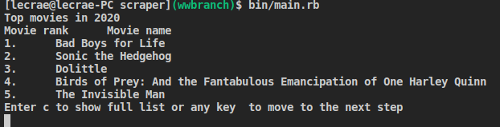
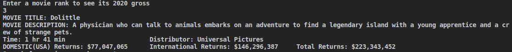
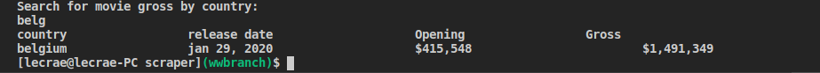

# scraper

Build a web scraper to get data from web pages

This is a ruby capstone in the microverse program that entails creating of scraper using Nokogiri gem

## Built With

- Ruby

## Video Presentation

[Video Link](https://www.loom.com/share/0130c6eef4aa43c7a438967338d12e4d)

## Setup Installation

                                            gem install nokogiri

nokogiri is a Rubygem providing HTML, XML, SAX, and Reader parsers with XPath and CSS selector support.

                                            gem install rspec

This will be for testing

## Getting Started

Instructions
We are getting data of Top Movies of the year 2020 from .[here](https://www.boxofficemojo.com/year/world/2020/?ref_=bo_hm_yrww)
1. Run bin/main.rb
- It will show the Top 5 Movies and the list can be expanded by pressing c

2. Enter the rank number of movie you want to analyse from the list given
- It will show you movie details and various returns

3. Search for returns by country
- It will show all countries beginning with that name

## 🤝 Contributing

You are welcome to make contributions to the repository. Contributions may be made through issues comments and feature requests.

## 👤 Author

# Hillary Okerio

- GitHub [@hillarioh](https://github.com/hillarioh/)
- Twitter: [@hillaokri](https://twitter.com/hillaokri)
- LinkedIn: [Hillary](https://www.linkedin.com/in/hillaryokerio/)

## Show your support

Give a ⭐️ if you like this project!

## 📝 License

This project is MiT licensed.
